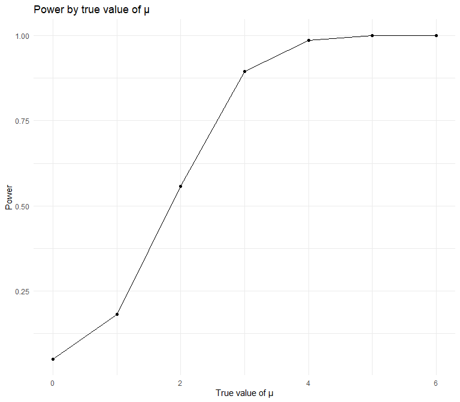
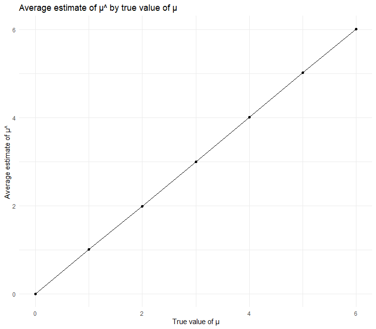
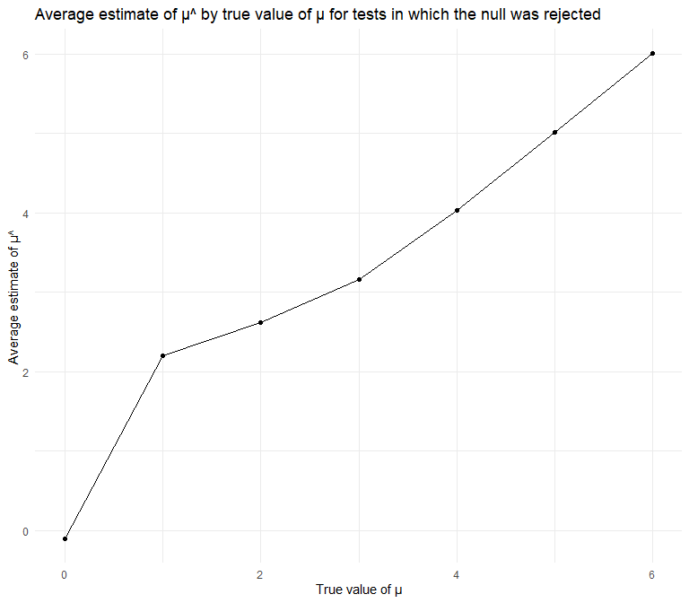

p8105_hw5_jmm2511
================
Jessie Merrifield
2023-11-15

``` r
set.seed(1)
```

# Problem 2

This zip file contains data from a longitudinal study that included a
control arm and an experimental arm. Data for each participant is
included in a separate file, and file names include the subject ID and
arm.

### Create a tidy dataframe containing data from all participants, including the subject ID, arm, and observations over time:

Start with a dataframe containing all file names; the list.files
function will help

``` r
file_names <- data.frame(file_names=list.files(path = "./data", include.dirs = TRUE),
                         path_names=dir(path = "./data", full.names = TRUE))
```

Iterate over file names and read in data for each subject using
purrr::map and saving the result as a new variable in the dataframe

``` r
file_data = function(path) {
  
  df = 
    read.csv(path) |>
    janitor::clean_names() 
  
  df
  
}


q2= 
  file_names |> 
  mutate(observations = purrr::map(path_names, file_data))

unnested_q2<-unnest(q2, cols = observations)
```

Tidy the result; manipulate file names to include control arm and
subject ID, make sure weekly observations are “tidy”, and do any other
tidying that’s necessary

``` r
long_q2<-unnested_q2 %>% 
    pivot_longer(
      week_1:week_8,
      names_to = "week", 
      values_to = "observations",
      names_prefix = "week_") %>% 
  separate(file_names, into = c("arm", "subject"), sep = "_") %>% 
  mutate(subject=str_replace(subject, ".csv","")) %>% 
  select(!path_names) 
```

Make a spaghetti plot showing observations on each subject over time

``` r
q2_spaghetti<-
  long_q2 %>% 
  group_by(week) %>% 
  ggplot(aes(x=as.numeric(week), y=as.numeric(observations),color=subject))+
  geom_line()+ 
  facet_grid(~arm)+
  labs(
    title = "Observations for each subject by week",
    x = "Week",
    y = "Observations",
    color = "Subject")

#changed the week and observations to numeric

q2_spaghetti
```


### comment on differences between groups

The control arm does not appear to change while there is a positive
slope for the experimental arm.

# Problem 3

When designing an experiment or analysis, a common question is whether
it is likely that a true effect will be detected – put differently,
whether a false null hypothesis will be rejected. The probability that a
false null hypothesis is rejected is referred to as power, and it
depends on several factors, including: the sample size; the effect size;
and the error variance. In this problem, you will conduct a simulation
to explore power in a one-sample t-test.

First set the following design elements:

Fix n=30 Fix σ=5 Set μ=0 . Generate 5000 datasets from the model

x∼Normal\[μ,σ\]

``` r
sim_mean_sd <- function(n=30, mu, sigma = 5) {
  
  sim_data <- tibble(
    x = rnorm(n, mean = mu, sd = sigma)
  )
  
  t_test_results <- t.test(sim_data$x, mu = 0) %>%
    broom::tidy() %>%
    select(p.value)
  
  mu_hat <- sim_data %>%
    summarize(mu_hat = mean(x))
  
  return(data.frame(mu_hat = mu_hat$mu_hat, p_value = t_test_results$p.value))
}

#used return to output the values of interest
#didn't input mu value to give more flexibility for mu input in future questions
```

``` r
sim_results_df = 
  expand_grid(
    mu_value = 0,
    iter = 1:5000
  ) |> 
  mutate(
    estimate_df = map(mu_value, ~sim_mean_sd(mu=.x))
  ) |> 
  unnest(estimate_df) |>
  select(mu_value, mu_hat, p_value)
```

For each dataset, save μ^ and the p-value arising from a test of H:μ=0
using α=0.05 . Hint: to obtain the estimate and p-value, use broom::tidy
to clean the output of t.test.

Repeat the above for μ={1,2,3,4,5,6} , and complete the following:

``` r
sim_results_df_repeat = 
  expand_grid(
    mu_value=c(0,1,2,3,4,5,6),
    iter = 1:5000
  ) |> 
  mutate(
    estimate_df = map(mu_value, ~sim_mean_sd(mu=.x))
  ) |> 
  unnest(estimate_df) |>
  select(mu_value, mu_hat, p_value)

#used c(0,1,2,3,4,5,6) to avoid merging datasets to use for future questions
```

Make a plot showing the proportion of times the null was rejected (the
power of the test) on the y axis and the true value of μ on the x axis.
Describe the association between effect size and power.

``` r
q3_power_plot<- sim_results_df_repeat %>%
  group_by(mu_value) %>% 
  summarise(power=sum(p_value<0.05)/5000)%>% 
    ggplot(aes(x=mu_value, y=power))+
    geom_point()+
    geom_line()+
  labs(
    title = "Power by true value of μ",
    x = "True value of μ",
    y = "Power")


q3_power_plot
```



As the true value of μ increases, the power of the test increases.

Make a plot showing the average estimate of μ^ on the y axis and the
true value of μ on the x axis.

``` r
q3_average_mu_plot<- sim_results_df_repeat %>%
  group_by(mu_value) %>% 
  summarise(average_mu_hat=mean(mu_hat))%>% 
    ggplot(aes(x=mu_value, y=average_mu_hat))+
    geom_point()+
  geom_line()+
  labs(
    title = "Average estimate of μ^ by true value of μ",
    x = "True value of μ",
    y = "Average estimate of μ^")

q3_average_mu_plot
```



There is a strong positive linear relationship between the average
estimate of μ^ and the true value of μ.

Make a second plot (or overlay on the first) the average estimate of μ^
only in samples for which the null was rejected on the y axis and the
true value of μ on the x axis. Is the sample average of μ^ across tests
for which the null is rejected approximately equal to the true value of
μ ? Why or why not?

``` r
q3_mu_null_rejected_plot<- sim_results_df_repeat %>%
  filter(p_value<0.05) %>% 
  group_by(mu_value) %>% 
  summarise(average_mu_hat=mean(mu_hat))%>% 
    ggplot(aes(x=mu_value, y=average_mu_hat))+
    geom_point()+
  geom_line()+
  labs(
    title = "Average estimate of μ^ by true value of μ for tests in which the null was rejected",
    x = "True value of μ",
    y = "Average estimate of μ^")


q3_mu_null_rejected_plot
```



For only samples in which the null was rejected, the sample average of
μ^ is not approximately equal to the true value of μ. The difference in
the sample average of μ^ and the true value of μ is especially apparent
for the lower true values of μ–this is because the proportion of times
the null was rejected is greater among lower true values of μ, which
leads to a larger skew in the data for the sample average of μ^.
